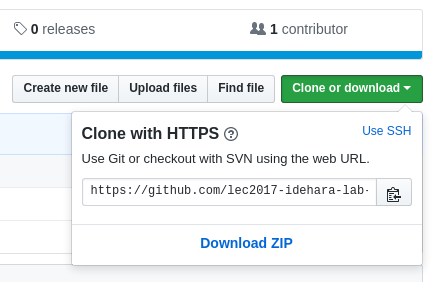

# github の基本操作

## ツールの準備

MSwindows では、https://git-for-windows.github.io/ がおすすめ。インストールする。右クリックメニューに「git bash」が追加されていることを確認する。

## ローカルリポジトリへの持ち出し

classroom 上で、このリポジトリは、各個人の所有するリポジトリとして自動的にクローンされている。リポジトリは https か ssh で参照するが、講義では https を使用する。枠内のリンクをコピーしておく。



このリポジトリを、各自のコンピュータ（ローカル）に持ち出す。

最初に持ち出すときは「クローン」を行う。ファイルを持ち出したいディレクトリで、git bash を起動し、

```
git init
```

で初期化してから

```
git clone [クローンしたいリポジトリ]
```

でクローンする。

メールアドレス・ユーザ名を毎回入力するのが面倒な場合

```
git config --global user.email your@email.address
git config --global user.name your_user_id
```

で登録するとよい。

## 作業結果のローカルでのコミット
作業結果は、適当なタイミングで

```
git add -A
git commit -m "メッセージ"
```

で記録する。これで、そこまでの一連の作業に名前（メッセージ）がついて、一つの作業単位として扱われる。 *必要以上にこまめにコミットしないこと*

## ローカルコミットの反映
これでは、自分のコンピュータ上にしか作業結果が存在しないため、これをサーバ側（リモート）に反映する。このために、

```
git push
```

でプッシュする。プッシュできるのは、自分がリモートリポジトリの書き込み権限を持っているからである。

## 複数台で操作している場合
複数のコンピュータで操作している場合、他のコンピュータで大本のリモートリポジトリにプッシュした内容は、ローカルリポジトリに自動的に送られてくるわけではない。このような場合、ローカルで作業を始める前に、リモートリポジトリの最新版を持ってくる必要がある。このため、

```
git pull
```

を使用する。
